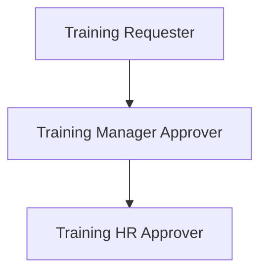
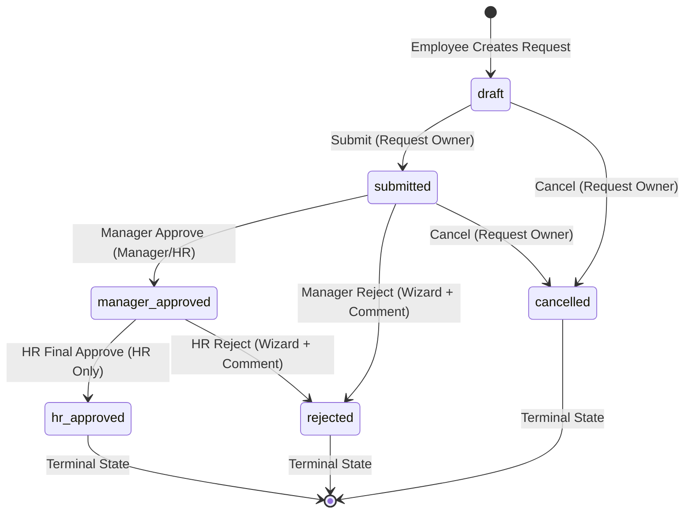

# HR Training Request

Odoo 18 Community module for requesting external training or certifications through a two-step approval workflow: employee submission, manager approval, then HR final approval.

## Version And Dependencies

- **Odoo Version**: Odoo 18.0 Community Edition
- **Module Dependencies**: `hr`, `mail`
- **Main Model**: `hr.training.request`

## Security Design & Hierarchy

The module defines a dedicated **Training Requests** security category with three implied groups:

- **Training Requester**: Base access to create, edit (in draft), submit, and view own requests.
- **Training Manager Approver**: Implies Requester access. Can approve or reject submitted requests for direct reports.
- **Training HR Approver**: Implies Manager Approver access. Final approval authority for all company training requests; controls access to `hr_notes`.

### Record Rules (Row-Level Security)
- **Requesters**: See only records where `employee_id.user_id` matches the current user.
- **Manager Approvers**: See their own requests plus requests for employees where `manager_id.user_id` matches the current user.
- **HR Approvers**: See all company requests via `company_id in company_ids`.

## Workflow Enforcement & State Machine

| From | Action | To | Authorized User |
| --- | --- | --- | --- |
| Draft | Submit | Submitted | Request owner |
| Draft | Cancel | Cancelled | Request owner |
| Submitted | Cancel | Cancelled | Request owner |
| Submitted | Approve | Manager Approved | Direct manager or manager approver group |
| Submitted | Reject | Rejected | Direct manager or manager approver group (via Wizard) |
| Manager Approved | Final Approve | HR Approved | HR approver group |
| Manager Approved | Reject | Rejected | HR approver group (via Wizard) |

*Terminal States*: `hr_approved`, `rejected`, `cancelled` are strict terminal states with no transitions out.

## Assumptions

- **Multi-Company Support**: Built using `company_id` (`default=lambda self: self.env.company`) and `currency_id` related to company. Record rules enforce company boundaries for HR users.
- **Manager Approval Authorization**: Any user belonging to `group_training_manager_approver` who has record visibility (or the direct manager via employee hierarchy) can approve/reject submitted requests. Record rules restrict record visibility so managers primarily see their direct reports and own records.
- **Dual-Layer `hr_notes` Security**: Protected by field-level `groups='hr_training_request.group_training_hr_approver'` (which raises `AccessError` on unauthorized ORM field access) as well as an explicit Python `write()` check for defense-in-depth against privileged ORM calls.
- **`manager_id` Live-Related Behavior**: `manager_id` is a stored related field to `employee_id.parent_id`. As verified in `test_35`, updating an employee's organizational manager automatically updates `manager_id` on existing requests, ensuring workflow routing always follows current organization structure.
- **Monetary vs Float for Cost**: `cost` uses `fields.Monetary` tied to `currency_id` for accurate financial representation.
- **Unlink Access Policy**: Business users cannot unlink/delete training requests; they must use cancellation to maintain an immutable audit trail.

## Scope

- **Course & Provider Master Data Catalog**: Kept as plain user-entered `Char` fields (`course_name`, `training_provider`) as requested by the specification, avoiding unnecessary master data management overhead for one-off external vendor requests.
- **Reset to Draft Transition**: Deliberately omitted to prevent state history manipulation and preserve audit trail integrity once a request is processed or rejected.

## Additions (Self-Initiated Scope)

- **Rejection Wizard (`hr.training.reject.wizard`)**: Interactive modal requiring non-empty user feedback when rejecting a request, logging reasons directly to chatter notes.
- **Interactive OWL Dashboard**: Responsive client action providing role-aware KPIs, actionable queue counters, and state distribution stats.
- **Automated Test Suite**: 37 comprehensive unit tests verifying security rules, authorization gates, and state machine correctness.

## Automated Verification

Full automated verification of security boundaries and state machine correctness — see [TEST_RESULTS.md](./TEST_RESULTS.md).

## Development Approach

I used Claude as an AI pair-programming aid during development — mainly for scaffolding boilerplate (view XML, test fixtures). Every security decision, ORM guard, and test case in this repo was reviewed, verified; AI was a productivity multiplier, not a substitute for understanding the Odoo security model.

## What I'd Improve With More Time

- Add automated activity notifications sent to managers upon submission and HR upon manager approval.
- Add budget policy thresholds (e.g. require executive approval for training exceeding 5,000).
- Implement training completion certificate attachment handling upon `hr_approved` stage.
- Explore an optional AI-assisted review layer (e.g., flagging requests where the justification, course, and cost look inconsistent) as decision support for managers/HR — deliberately left out here to avoid over-engineering a scoped assignment.
